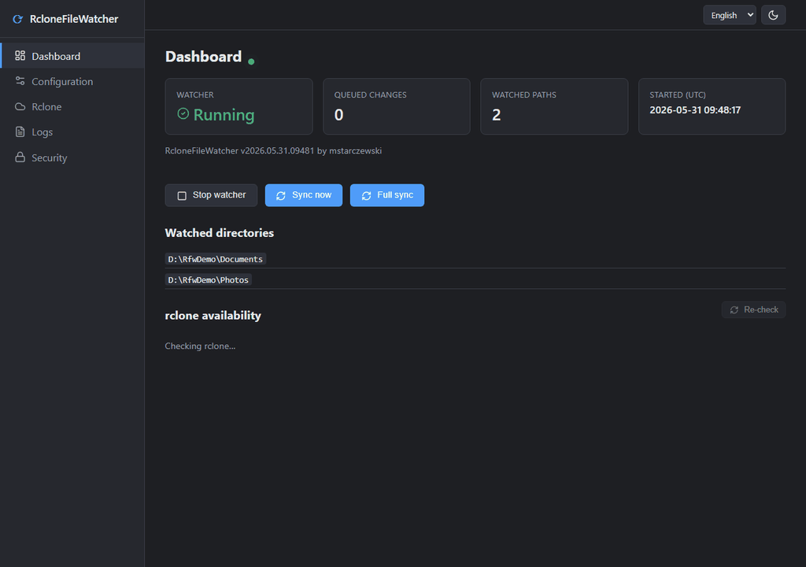

# RcloneFileWatcherCore

[](https://github.com/mstarczewski/RcloneFileWatcherCore/actions)
[](https://github.com/mstarczewski/RcloneFileWatcherCore/releases)
[](https://github.com/mstarczewski/RcloneFileWatcherCore/releases)
[](https://github.com/mstarczewski/RcloneFileWatcherCore)
[](https://github.com/mstarczewski/RcloneFileWatcherCore)
[](https://github.com/mstarczewski/RcloneFileWatcherCore)
[](https://github.com/mstarczewski/RcloneFileWatcherCore/blob/master/LICENSE)


---

## About

**RcloneFileWatcherCore** is a **multi-platform** .NET 8-based tool that enables real-time one-way file synchronization using filesystem change tracking. Instead of scanning entire folders, it watches for file and directory changes and launches `rclone` to sync only the affected files.

>### ℹ️ Secure backups
> **This makes it possible to perform secure, real-time, encrypted backups to cloud storage providers supported by rclone.**

The configuration is optimized for Windows and Linux. On Windows, it is recommended to compile the program yourself to avoid security warnings from system features like SmartScreen. On Linux, self-compilation is optional; there are no signed binaries restrictions.

---

## Web GUI preview

The optional cross-platform web GUI (shown in English; Polish and German are also built in). The
slideshow cycles through the main pages — **Dashboard**, **Configuration**, **Rclone** command
preview, **Logs** (with kept errors), and **Security**:



---

## Key Features

- Real-time file and directory change monitoring
- Two ways to run rclone per watched path:
  - **Script mode** – run your own `.bat`/`.sh` (the original behavior)
  - **Managed mode** – build the rclone command from fields; the app runs rclone directly and injects `--include-from` automatically
- Changed-file list passed to rclone **via stdin** (`--include-from -`) — no on-disk exchange file needed (handles very large lists)
- Live rclone output captured into the log (both managed and script mode); `{datetime}`/`{date}`/`{time}`/`{year}` placeholders substituted at run time
- Optional full-sync at startup and/or daily at a set time — **also configurable as managed commands**
- Enable/disable individual watched paths or full-sync commands without deleting them
- Optionally auto-updates the rclone binary
- Cross-platform **web GUI** (Blazor Server) for configuration, live status/logs and rclone command building:
  - Live dashboard with start/stop, sync-now, full-sync-now and a **Stop rclone** button
  - rclone availability + version shown per configured path
  - Errors are **kept visible** in the log until cleared (they don't scroll away)
  - Warnings when a command has `--dry-run` enabled or a sync is disabled
  - GUI-managed password (hashed, runtime on/off), light/dark theme, and English/Polish/German UI
- Hot-reload: configuration changes apply **without restarting** (the watcher is rebuilt live)
- **Email alerts on errors** — batched (first error opens a delay window so a burst becomes one mail), optionally **OpenPGP-encrypted** per recipient (public key fetched from keys.openpgp.org or pasted); SMTP password stored encrypted at rest

---

## ⚙️ Requirements

- [.NET 8.0 Runtime](https://dotnet.microsoft.com/en-us/download)
- [rclone](https://rclone.org/downloads/) **version ≥ 1.56**
- Supported OS:
  - **Windows** (tested, recommended to compile yourself to avoid security warnings)
  - **Linux** (tested, no signed binaries restrictions)
  - **macOS** (requires self-compilation and possible adaptation; not tested)

---

## Installation

1. Install and configure [rclone](https://rclone.org/)
2. Download [source code or binaries](https://github.com/mstarczewski/RcloneFileWatcherCore/releases)
3. ⚠️ **Windows only:** For security, it's recommended to compile the program yourself. Unsigned binaries may be blocked by system security features.  
   **Linux:** Self-compilation is optional; there are no signed binaries restrictions.

---

## Configuration

Create a config file named `RcloneFileWatcherCoreConfig.cfg` in the executable folder:

```json
{
  "LogLevel": "Information|Error|Debug",
  "LogPath": "RcloneFileWatcherCore.log",
  "Path": [
    {
      "WatchingPath": "/home/user/Test/",
      "RcloneFilesFromPath": "/home/user/files-from-test.txt",
      "RcloneBatch": "/home/user/rclone_Test.sh",
      "ExcludeContains": [
        ".tmp",
        ".drivedownload1"
      ]
    },
    {
      "WatchingPath": "/home/user/Test1/",
      "RcloneFilesFromPath": "/home/user/files-from-test1.txt",
      "RcloneBatch": "/home/user/rclone_Test1.sh",
      "ExcludeContains": [
        ".tmp",
        ".drivedownload1"
      ]
    }
  ],
  "UpdateRclone": {
    "Update": true,
    "RclonePath": "./rclone",
    "CheckUpdateHours": 350
  },
  "SyncIntervalSeconds": 30,
  "RunOneTimeFullStartupSync": true,
  "RunOneTimeFullStartupSyncBatch": "rclone_fullsync.sh",
  "RunStartupScriptEveryDayAt": "05:30"
}

```

### Configuration Parameters

* `"LogLevel": Information|Error `" – Sets the logging level. Multiple levels can be combined using the pipe (|), e.g. Trace|Debug|Information|Warning|Error|Critical|Always.
* `"LogPath": "RcloneFileWatcherCore.log"` – Specifies the log file path. Leave empty (`""`) to output logs to the console instead.
* `"WatchingPath"` – Directory to monitor for changes
* `"RcloneFilesFromPath"` – Path to the output file used with `--include-from` in rclone
* `"RcloneBatch"` – Path to the batch script that runs rclone (executed every 30 seconds if changes are detected). This script **must** include the `--include-from` parameter
* `"ExcludeContains"` – List of substrings; any path containing these will be excluded
* `"UpdateRclone"` – Section responsible for auto-updating rclone
* `"Update"` – Enables automatic rclone updates
* `"RclonePath"` – Path to the local `rclone.exe`
* `"RcloneWebsiteCurrentVersionAddress"` – URL to the latest rclone binary
* `"CheckUpdateHours"` – How often (in hours) to check for updates
* `"SyncIntervalSeconds"` -	Interval between sync attempts (if changes detected)
* `"RunOneTimeFullStartupSync"` -	Runs a full sync batch at startup
* `"RunOneTimeFullStartupSyncBatch"` - Path to full sync batch script
* `"RunStartupScriptEveryDayAt"` - Runs the startup script (full sync) once per day at the specified time.
* `"CollapseDirectoryChanges"` – When `true`, a whole created/renamed/deleted directory is passed to rclone as a single `dir/**` rule instead of every file under it (efficient for bursts of thousands of files; rclone walks just that subtree). Default `false`. (Configuration → General)
* `"QuietPeriodSeconds"` – Debounce: defer the live sync while changes keep arriving and run only once none has appeared for this many seconds (so a long copy is synced after it settles, not in many partial runs). `0` = off. (Configuration → General)
* `"QuietPeriodMaxWaitSeconds"` – Safety cap for the quiet period: sync anyway once the oldest pending change has waited this long. `0` = no cap.

> The config also supports the **managed** mode used by the GUI: per path `"Enabled"`, `"SyncMode"`
> (`Script`/`Managed`) and an `"RcloneCommand"` object, plus top-level `"FullSyncMode"` and a
> `"FullSyncCommands"` list. You don't need to hand-write these — the **Configuration** page builds
> and saves them for you (and can import an existing script into managed fields).

### Example rclone script (Linux) (`rclone_livesync_shared.sh`)

```bash
#!/bin/bash

datetime=$(date '+%Y-%m-%d-%H-%M-%S')
year=$(date '+%Y')

mkdir -p /var/log/rclone

/opt/rclone/rclone sync --include-from /var/log/rclone/files-from-shared.txt /mnt/samba/Shared pcloudcryptDaily:Shared \
  --retries-sleep 1m \
  --retries 30 \
  --bwlimit 15M:off \
  --create-empty-src-dirs \
  --backup-dir "pcloudcryptDaily:\$Archive/Shared/${year}" \
  --suffix " [${datetime}]" \
  --log-file=/var/log/rclone/livesync_shared_${datetime}.log \
  --log-level INFO
```
### Example rclone script (Linux) (`rclone_startupsync.sh`)

```bash
#!/bin/bash

datetime=$(date '+%Y-%m-%d-%H-%M-%S')
year=$(date '+%Y')

mkdir -p /var/log/rclone

/opt/rclone/rclone sync /mnt/samba/Shared/ pcloudcryptDaily:Shared \
  --bwlimit 15M \
  --transfers=6 \
  --checkers=12 \
  --use-mmap \
  --backup-dir "pcloudcryptDaily:\$Archive/Shared/${year}" \
  --suffix " [${datetime}]" \
  --create-empty-src-dirs \
  --log-file=/var/log/rclone/shared_${datetime}.log \
  --log-level INFO
```

### Example rclone script (Windows) (`rclone_livesync_shared.bat`)

```bash
@echo off
setlocal
for /f "delims=" %%a in (
    'powershell -Command "Get-Date -Format ''yyyy-MM-dd-HH-mm-ss''"'
) do set "datetime=%%a"
for /f "delims=" %%b in (
    'powershell -Command "Get-Date -Format ''yyyy''"'
) do set "year=%%b"
@echo on
rclone.exe sync --config="C:\rclone\rclone.conf" --include-from .\Logs\files-from-shared.txt e:\Shared pcloudcryptDaily:Shared --retries-sleep 1m --retries 30 --bwlimit 30M:off --create-empty-src-dirs --backup-dir pcloudcryptDaily:$Archive\Shared\%year% --suffix " [%datetime%]" --log-file=.\Logs\log_livesync_shared.txt --log-level INFO
@endlocal
```
### Example rclone script (Windows) (`rclone_startupsync.bat`)

```bash
@echo off
setlocal
for /f "delims=" %%a in (
    'powershell -Command "Get-Date -Format ''yyyy-MM-dd-HH-mm-ss''"'
) do set "datetime=%%a"
for /f "delims=" %%b in (
    'powershell -Command "Get-Date -Format ''yyyy''"'
) do set "year=%%b"
@echo on
"D:\Rclone\rclone.exe" sync e:\Shared pcloudcryptDaily:Shared --bwlimit 25M:off --transfers=32 --checkers=60 --backup-dir pcloudcryptDaily:$Archive\Shared\%year% --suffix " [%datetime%]" --create-empty-src-dirs --log-file=d:\log_shared.txt --log-level INFO
@endlocal
```

---

## Web GUI (optional)

A cross-platform **web GUI** (ASP.NET Core Blazor Server) is available alongside the console app.
It shares the same core, reads/writes the same `RcloneFileWatcherCoreConfig.cfg`, and applies
configuration changes **without restarting** (the watcher is reloaded live).

### Running

```bash
dotnet run --project RcloneFileWatcherCore.Web
# or run the published build:
dotnet RcloneFileWatcherCore.Web.dll
```

Then open <http://localhost:5005>. The GUI looks for `RcloneFileWatcherCoreConfig.cfg` in the
working directory; if it is missing it starts empty so you can create the configuration from the
browser.

The GUI is localized (English by default, plus Polish and German) with a light/dark theme toggle;
language is switchable from the top bar and new languages can be added by dropping a
`locales/<culture>.json` file next to the binary — no recompile.

### Pages

* **Dashboard** – live status (watcher state, queued changes, watched paths) and controls:
  start/stop the watcher, sync now, full sync now, and **Stop rclone** (kills the running rclone).
  Shows the rclone version/availability for each configured path and warns when `--dry-run` is on
  or a sync is disabled.
* **Configuration** – tabbed editor (General / Full sync / Watched paths). Every field has a `?`
  tooltip. Each path and full-sync command has an **Enabled** toggle and can be imported from an
  existing `.bat`/`.sh` (a multi-command full-sync script is split into separate managed commands).
  Save applies live.
* **Rclone** – per-path and full-sync preview of the effective rclone command line.
* **Logs** – live log stream with a level filter and download. **Errors are kept** in a separate
  panel until you clear them, so a problem stays visible long after it scrolled out of the buffer.
* **Notifications** – error-email alerts: SMTP server, batch window (delay from the first error),
  and per-recipient **OpenPGP** encryption (fetch the public key from keys.openpgp.org or paste it),
  with a *Send test email* button. Settings live in a gitignored `notifications.json`; the SMTP
  password is encrypted at rest (Data Protection).
* **Security** – turn the password requirement on/off and set/change the password (see below).

### rclone invocation: script vs managed

Each watched path (and the full sync) runs rclone in one of two modes:

* **Script** – run the `.bat`/`.sh` file (which must contain the full rclone command, including
  `--include-from`). Its output is captured into the GUI log.
* **Managed** – build the rclone command from fields in the GUI; the app runs rclone directly.
  - `--include-from` is injected automatically; by default the changed-file list is piped to rclone
    via **stdin** (`--include-from -`) so there is no temporary file on disk.
  - Common flags are first-class checkboxes/fields: `--bwlimit`, `--transfers`, `--checkers`,
    `--retries`, `--backup-dir`, `--suffix`, `--log-file`, `--create-empty-src-dirs`, `--use-mmap`,
    `--fast-list`, `--update`, `--dry-run`; anything else goes in *extra arguments*.
  - Date/time placeholders are substituted at run time: `{datetime}` → `yyyy-MM-dd-HH-mm-ss`,
    `{date}`, `{time}`, `{year}` — e.g. `--suffix " [{datetime}]"`,
    `--backup-dir remote:$Archive/Shared/{year}`.

### Authentication

Access control is managed entirely from the **Security** page (no setting needed): toggle the
password requirement on/off and set the password at runtime — the change takes effect immediately,
no restart. The password is stored **hashed** (PBKDF2) in `gui-auth.json` next to the binary (this
file is gitignored and must never be published). Minimum policy: 8+ characters with a letter and a
digit. With no password set, access is open (intended for localhost). When exposing the GUI on a
network, set a password and put it behind an **HTTPS reverse proxy** (over plain HTTP the password
and cookie travel in clear text).

### Settings (`appsettings.json` / environment)

* `Gui:Urls` – bind address. Defaults to `http://localhost:5005`. Use e.g. `http://0.0.0.0:5005`
  to expose on the LAN.
* `Gui:OpenBrowser` – `true` to open the browser on startup (desktop convenience; keep `false`
  for headless/service deployments).

### HTTPS (optional — encrypt the proxy → backend hop)

By default the GUI serves plain HTTP and TLS terminates at the reverse proxy. To encrypt the
proxy ↔ backend hop too, set an https endpoint — e.g. `Gui:Urls=https://0.0.0.0:5005`. With no
certificate configured the app **generates and persists a self-signed one** (`gui-cert.pfx`) next
to the binary and exports its public part to **`gui-cert.crt`**. Tell the proxy to trust it — Caddy:

```caddyfile
reverse_proxy https://127.0.0.1:5005 {
    transport http {
        tls_trusted_ca_certs /opt/RcloneFileWatcherCoreWeb/gui-cert.crt
    }
}
```

…or skip verification with `transport http { tls_insecure_skip_verify }`. Optional settings:
`Gui:CertPath` + `Gui:CertPassword` to use your own PFX instead, and `Gui:CertHost` to add a SAN
hostname the proxy dials. `gui-cert.pfx`/`gui-cert.crt` are gitignored.

### Deployment

The web GUI **must be deployed as a folder** — the published output (the `.dll`/apphost together
with `wwwroot/` and `locales/` beside it), not a single file. Run it with `dotnet
RcloneFileWatcherCore.Web.dll` or the platform apphost, with the working directory set to that
folder. On Linux use systemd; on Windows use a service manager such as NSSM.

One-click publishers (Windows, no Visual Studio needed): **`publish-web-win.cmd`** (Windows web
folder), **`publish-web-linux.cmd`** (Debian/Linux web folder), **`publish-tray.cmd`** (tray exe).

---

## Windows tray (optional)

`app-tray-win-x64.zip` is a small **system-tray companion** (Windows only). It shows a coloured dot
near the clock reflecting the watcher state — **green** syncing, **gray** idle, **red** errors,
**hollow** offline — with a right-click menu (*Open GUI* / *Re-check* / *Exit*). It reads the web
app's `/api/status`. Drop `RcloneFileWatcherCore.Tray.exe` into the published web folder and it
launches the web app on start (and stops it on exit); or run it standalone pointing at a URL:
`RcloneFileWatcherCore.Tray.exe http://localhost:5005`. Framework-dependent build → needs the
.NET 8 **Desktop** Runtime.

---

## Releases

Release builds (Windows + Linux: the console app and the web GUI) are produced by GitHub Actions
and attached to a GitHub Release. A release is cut when **any** of these happens:

- a commit pushed to `master` has `[release]` in its message, or
- a version tag `v*.*` is pushed, or
- the workflow is run manually (Actions → *Build & Release* → *Run workflow*).

The version is CalVer `YYYY.MM.DD.HHmms` (UTC), taken from the tag when one is given. Ordinary
pushes to `master` (without `[release]`) do **not** create a release.

---

### Additional Notes

* On Linux, you can run it as a background service using systemd or nohup.
* On Windows, you can run this tool as a service using **[NSSM](https://nssm.cc/)** – the Non-Sucking Service Manager.
* It is recommended to run  `RcloneFileWatcherCore` in the background continuously, and setup `RunStartupScriptEveryDayAt` a full rclone sync once per day to ensure data consistency. Ideally, the full sync should result in no changes if the watcher worked correctly.
